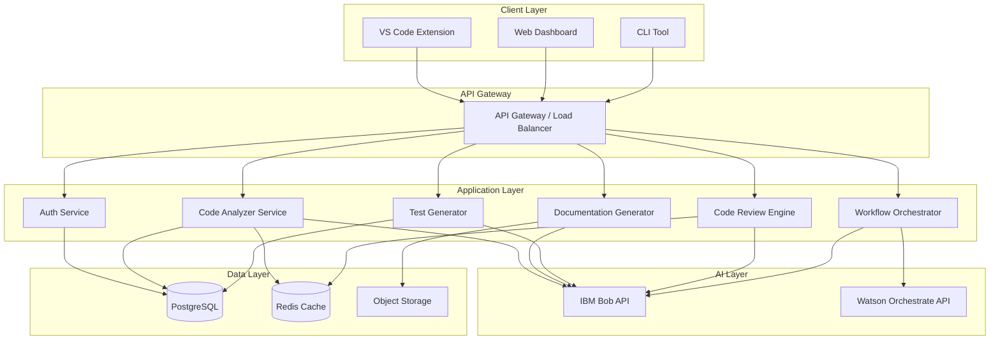
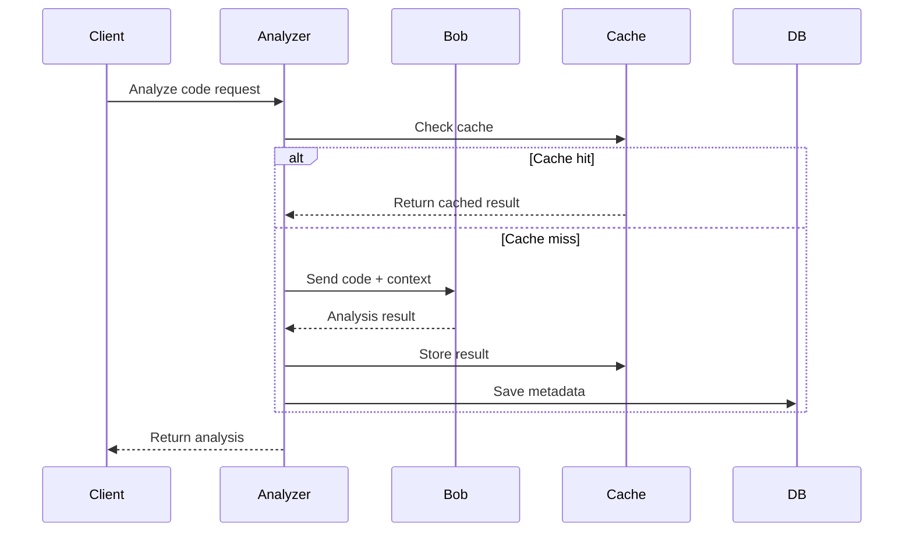
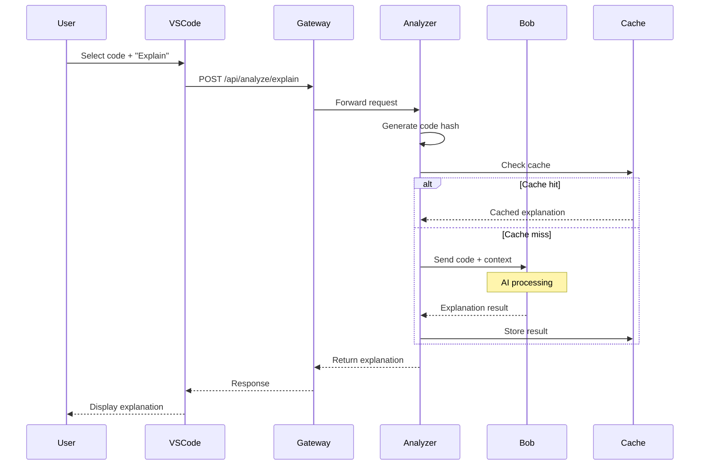
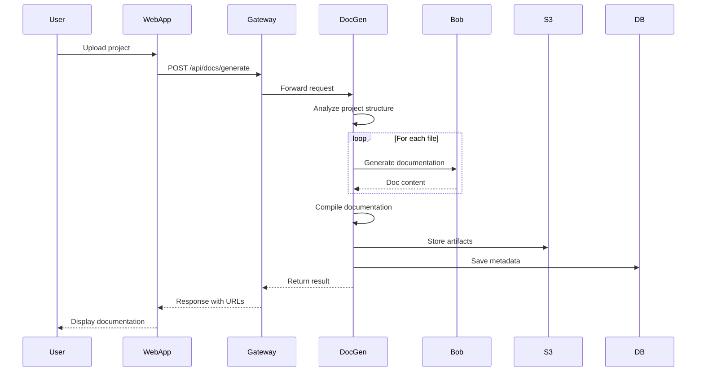
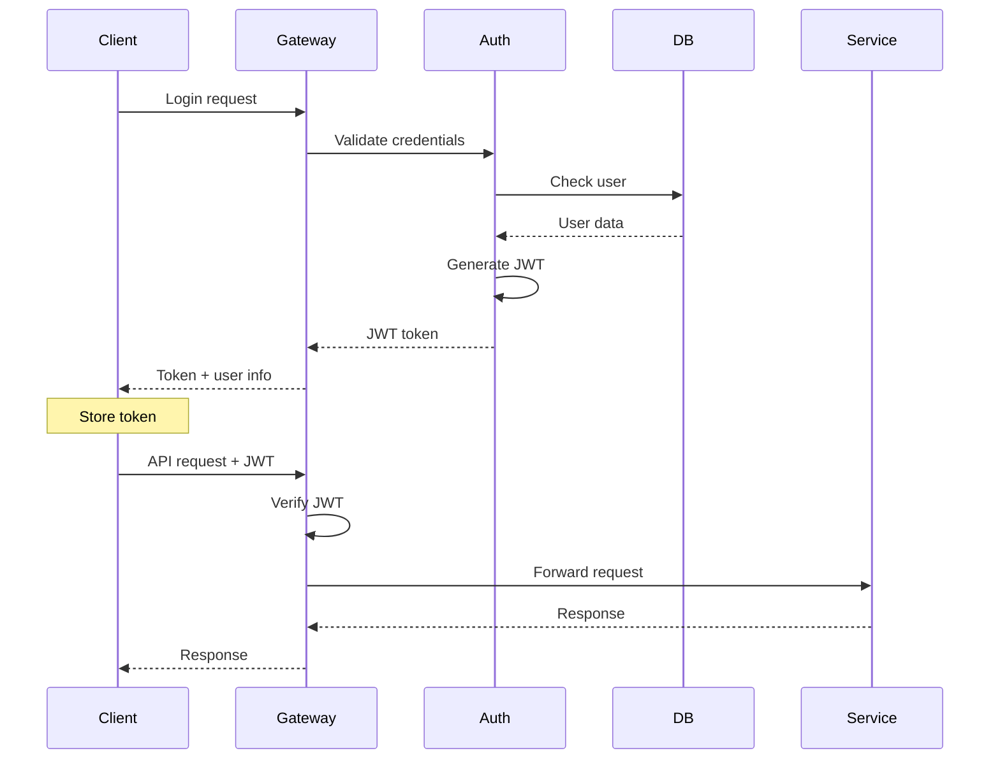
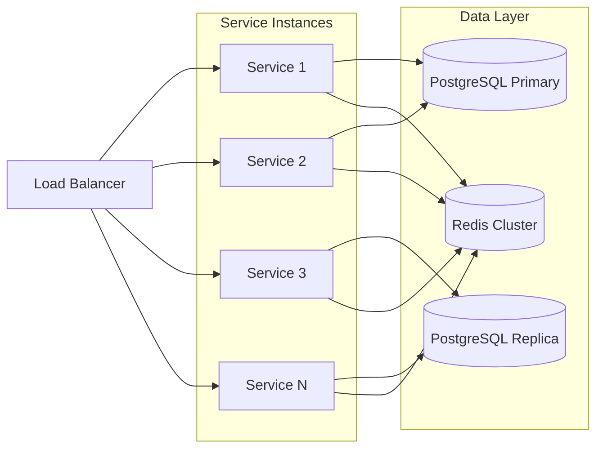
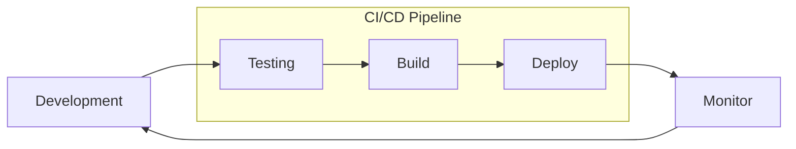

# DevFlow AI - Technical Architecture

## System Architecture Overview



## Component Details

### 1. Client Layer

#### VS Code Extension
- **Technology**: TypeScript, VS Code Extension API
- **Features**:
  - Inline code explanations
  - Quick actions menu
  - Real-time code review
  - Test generation shortcuts
  - Documentation preview
- **Communication**: REST API + WebSocket for real-time updates

#### Web Dashboard
- **Technology**: React 18, TypeScript, Tailwind CSS, Shadcn/ui
- **Features**:
  - Analytics and metrics
  - Project management
  - Team collaboration
  - Workflow builder
  - History and versioning
- **State Management**: Zustand
- **Data Fetching**: TanStack Query

#### CLI Tool
- **Technology**: Node.js, Commander.js
- **Features**:
  - Batch processing
  - CI/CD integration
  - Scripting support
  - Automation pipelines

### 2. API Gateway

- **Technology**: Node.js, Express, Express Gateway
- **Responsibilities**:
  - Request routing
  - Rate limiting
  - Authentication/Authorization
  - Request validation
  - Response caching
  - Load balancing

### 3. Application Services

#### Code Analyzer Service


**Responsibilities**:
- Parse and tokenize code
- Extract context and dependencies
- Generate explanations at multiple levels
- Create visual diagrams
- Identify patterns and anti-patterns

**IBM Bob Integration**:
- Sends full repository context
- Requests multi-level explanations
- Gets architectural insights
- Receives improvement suggestions

#### Documentation Generator
**Responsibilities**:
- Generate README files
- Create API documentation
- Generate inline comments
- Build wiki pages
- Create architecture diagrams

**Output Formats**:
- Markdown
- HTML
- OpenAPI/Swagger
- JSDoc/TSDoc
- Docusaurus

#### Test Generator
**Responsibilities**:
- Analyze code logic
- Identify test scenarios
- Generate test cases
- Create mock data
- Calculate coverage

**Test Types**:
- Unit tests
- Integration tests
- E2E tests
- Performance tests
- Security tests

#### Code Review Engine
**Responsibilities**:
- Static code analysis
- Security vulnerability detection
- Performance optimization suggestions
- Best practice enforcement
- Code smell detection

**Analysis Categories**:
- Bugs and errors
- Security issues
- Performance problems
- Code style
- Maintainability

#### Workflow Orchestrator
**Responsibilities**:
- Define custom workflows
- Execute multi-step processes
- Integrate with external tools
- Handle error recovery
- Provide progress tracking

**Watson Orchestrate Integration**:
- Complex workflow execution
- External API integration
- Business process automation
- Event-driven workflows

### 4. AI Layer

#### IBM Bob API Integration
```typescript
interface BobRequest {
  task: 'explain' | 'document' | 'test' | 'review' | 'refactor';
  code: string;
  context: {
    language: string;
    framework?: string;
    dependencies?: string[];
    relatedFiles?: string[];
  };
  options: {
    detailLevel?: 'basic' | 'intermediate' | 'expert';
    format?: string;
    includeExamples?: boolean;
  };
}

interface BobResponse {
  result: string;
  metadata: {
    confidence: number;
    processingTime: number;
    tokensUsed: number;
  };
  suggestions?: string[];
  warnings?: string[];
}
```

**Key Capabilities Used**:
- Context understanding
- Code explanation
- Pattern recognition
- Best practice knowledge
- Multi-language support

#### Watson Orchestrate Integration
```typescript
interface WorkflowDefinition {
  id: string;
  name: string;
  steps: WorkflowStep[];
  triggers: Trigger[];
  errorHandling: ErrorHandler;
}

interface WorkflowStep {
  id: string;
  type: 'bob' | 'api' | 'script' | 'condition';
  action: string;
  inputs: Record<string, any>;
  outputs: string[];
}
```

### 5. Data Layer

#### PostgreSQL Schema
```sql
-- Users and authentication
CREATE TABLE users (
  id UUID PRIMARY KEY,
  email VARCHAR(255) UNIQUE NOT NULL,
  name VARCHAR(255),
  created_at TIMESTAMP DEFAULT NOW()
);

-- Projects
CREATE TABLE projects (
  id UUID PRIMARY KEY,
  user_id UUID REFERENCES users(id),
  name VARCHAR(255) NOT NULL,
  repository_url TEXT,
  language VARCHAR(50),
  created_at TIMESTAMP DEFAULT NOW()
);

-- Analysis history
CREATE TABLE analyses (
  id UUID PRIMARY KEY,
  project_id UUID REFERENCES projects(id),
  type VARCHAR(50) NOT NULL,
  input_hash VARCHAR(64),
  result JSONB,
  metadata JSONB,
  created_at TIMESTAMP DEFAULT NOW()
);

-- Generated artifacts
CREATE TABLE artifacts (
  id UUID PRIMARY KEY,
  analysis_id UUID REFERENCES analyses(id),
  type VARCHAR(50) NOT NULL,
  content TEXT,
  format VARCHAR(50),
  storage_url TEXT,
  created_at TIMESTAMP DEFAULT NOW()
);

-- Workflows
CREATE TABLE workflows (
  id UUID PRIMARY KEY,
  user_id UUID REFERENCES users(id),
  name VARCHAR(255) NOT NULL,
  definition JSONB NOT NULL,
  is_active BOOLEAN DEFAULT true,
  created_at TIMESTAMP DEFAULT NOW()
);

-- Workflow executions
CREATE TABLE workflow_executions (
  id UUID PRIMARY KEY,
  workflow_id UUID REFERENCES workflows(id),
  status VARCHAR(50) NOT NULL,
  started_at TIMESTAMP DEFAULT NOW(),
  completed_at TIMESTAMP,
  result JSONB
);
```

#### Redis Cache Strategy
```typescript
// Cache keys structure
const CACHE_KEYS = {
  codeAnalysis: (hash: string) => `analysis:${hash}`,
  documentation: (hash: string) => `docs:${hash}`,
  tests: (hash: string) => `tests:${hash}`,
  review: (hash: string) => `review:${hash}`,
  userSession: (userId: string) => `session:${userId}`,
};

// TTL configuration
const CACHE_TTL = {
  codeAnalysis: 3600, // 1 hour
  documentation: 7200, // 2 hours
  tests: 3600,
  review: 1800, // 30 minutes
  userSession: 86400, // 24 hours
};
```

## Data Flow Examples

### Code Explanation Flow


### Documentation Generation Flow


## Security Architecture

### Authentication Flow


### Security Measures
- JWT-based authentication
- API key management
- Rate limiting per user/IP
- Input validation and sanitization
- SQL injection prevention
- XSS protection
- CORS configuration
- Encrypted data at rest
- TLS/SSL for data in transit
- Regular security audits

## Scalability Strategy

### Horizontal Scaling


### Performance Optimization
- Response caching with Redis
- Database query optimization
- Connection pooling
- Lazy loading
- Code splitting
- CDN for static assets
- Gzip compression
- Image optimization
- Async processing for heavy tasks
- Background job queues

## Deployment Architecture

### Docker Compose Structure
```yaml
version: '3.8'

services:
  gateway:
    build: ./gateway
    ports:
      - "3000:3000"
    environment:
      - NODE_ENV=production
    depends_on:
      - postgres
      - redis

  code-analyzer:
    build: ./services/code-analyzer
    environment:
      - BOB_API_KEY=${BOB_API_KEY}
    depends_on:
      - postgres
      - redis

  doc-generator:
    build: ./services/doc-generator
    environment:
      - BOB_API_KEY=${BOB_API_KEY}
    depends_on:
      - postgres
      - redis

  test-generator:
    build: ./services/test-generator
    environment:
      - BOB_API_KEY=${BOB_API_KEY}
    depends_on:
      - postgres
      - redis

  review-engine:
    build: ./services/review-engine
    environment:
      - BOB_API_KEY=${BOB_API_KEY}
    depends_on:
      - postgres
      - redis

  workflow-orchestrator:
    build: ./services/workflow-orchestrator
    environment:
      - BOB_API_KEY=${BOB_API_KEY}
      - WATSON_API_KEY=${WATSON_API_KEY}
    depends_on:
      - postgres
      - redis

  postgres:
    image: postgres:15
    environment:
      - POSTGRES_DB=devflow
      - POSTGRES_USER=devflow
      - POSTGRES_PASSWORD=${DB_PASSWORD}
    volumes:
      - postgres-data:/var/lib/postgresql/data

  redis:
    image: redis:7-alpine
    volumes:
      - redis-data:/data

  web-app:
    build: ./web-app
    ports:
      - "80:80"
    depends_on:
      - gateway

volumes:
  postgres-data:
  redis-data:
```

## Monitoring and Observability

### Metrics to Track
- API response times
- Error rates
- Cache hit rates
- Bob API usage
- User activity
- System resource usage
- Database performance
- Queue lengths

### Logging Strategy
```typescript
interface LogEntry {
  timestamp: string;
  level: 'info' | 'warn' | 'error';
  service: string;
  message: string;
  metadata: {
    userId?: string;
    requestId?: string;
    duration?: number;
    error?: Error;
  };
}
```

## Technology Justification

### Why React + TypeScript?
- Type safety reduces bugs
- Large ecosystem
- Excellent developer experience
- Strong community support
- Easy to find developers

### Why Node.js?
- JavaScript everywhere
- Fast development
- Great for I/O operations
- Large package ecosystem
- Easy deployment

### Why PostgreSQL?
- ACID compliance
- JSON support
- Powerful querying
- Reliable and mature
- Great performance

### Why Redis?
- Extremely fast
- Simple to use
- Multiple data structures
- Pub/sub support
- Persistence options

## Development Workflow



### Git Workflow
- Main branch: production-ready code
- Develop branch: integration branch
- Feature branches: individual features
- Pull requests with code review
- Automated testing on PR
- Automated deployment on merge

## Future Enhancements

### Phase 2 Features
- Multi-language support in UI
- Team collaboration features
- Advanced analytics
- Custom AI model training
- Plugin system
- Mobile app

### Phase 3 Features
- Enterprise features
- On-premise deployment
- Advanced security features
- Compliance certifications
- White-label options
- API marketplace
